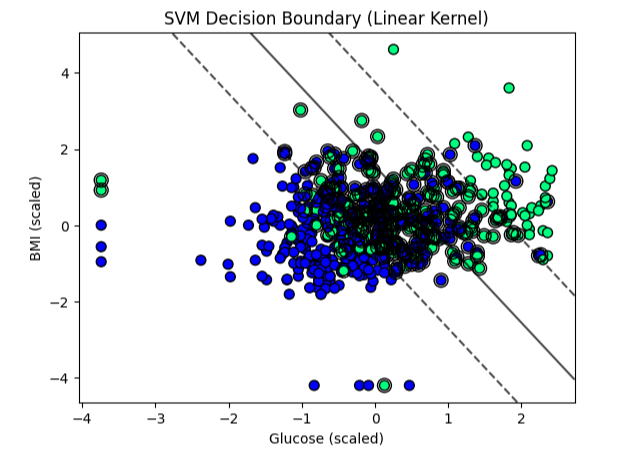
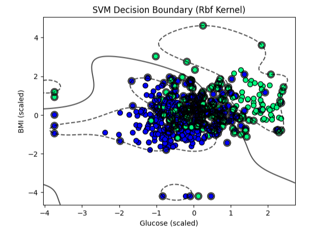

#  Diabetes Prediction using Support Vector Machine (SVM)

##  Project Overview
This project uses **Support Vector Machine (SVM)** to predict whether a patient is diabetic based on medical attributes.  
The **Diabetes Dataset** is used for training and testing.  
Data preprocessing, model training, evaluation, and visualization are performed.

---

##  Technologies Used
- Python
- Pandas
- NumPy
- Matplotlib
- Scikit-learn

---

##  Steps Performed
1. **Data Preprocessing**
   - Normalized/Standardized features using `StandardScaler`

2. **Model Training**
   - Used **Support Vector Classifier (SVC)** from Scikit-learn
   - Tried different kernels: `linear`, `rbf`
   - Selected best kernel based on accuracy

3. **Model Evaluation**
   - Calculated **Accuracy**, **Confusion Matrix**, and **Classification Report**
   - Compared results across different kernels

4. **Visualization**
   - Plotted confusion matrix
   - Visualized decision boundaries (for 2D feature selection)

---

##  Results & Visualizations
### 1. SVM with Linear Kernel
_Decision boundary formed by a straight line._

---

### 2. SVM with RBF Kernel
_Decision boundary with a non-linear curve._

---

###  Accuracy Score
- **Linear Kernel Accuracy**: `0.753`
- **RBF Kernel Accuracy**: `0.744`
---
## Conclusion
- Linear SVM works best for linearly separable data.
- RBF Kernel is more flexible and performs better for complex patterns.
  
